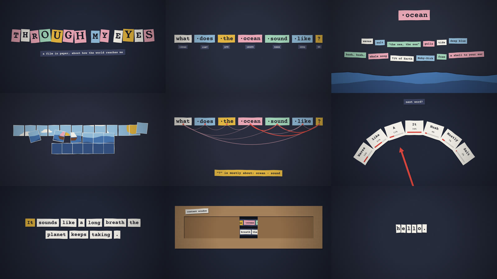

# animation_test

**A 62-second stop-motion short, made end to end by Claude Opus 5.5 in a single Claude Code session, from four prompts.**

The film, *Through Claude's Eyes*, follows one question ("what does the ocean sound like?") through the way a language model receives it: cut into tokens, pulled toward everything people wrote about the sea, weighed word by word, and answered one word at a time. It is cut-paper animation at 8 frames per second, with a synthesized score, foley, and a cloned-voice narration.

This repo shows exactly how it was made: the prompts, the code Claude wrote, and the commands that turned it into an MP4. Nothing in the video was drawn, recorded, or edited by hand.



| File | What it is |
|---|---|
| [`through-claudes-eyes-narrated.mp4`](through-claudes-eyes-narrated.mp4) | Final film: picture, music, foley, voice-over, subtitle track (1920×1080, 62 s) |
| [`through-claudes-eyes.mp4`](through-claudes-eyes.mp4) | Same film without narration |
| [`through-claudes-eyes.html`](through-claudes-eyes.html) | The live version: open it in a browser (silent, with scrubber and onion-skin toggle) |

## What happened

The full list of prompts is in
[`.journal/prompt/202609/prompt-20260923-1625-philipp-stopmotion-film.md`](.journal/prompt/202609/prompt-20260923-1625-philipp-stopmotion-film.md).
A session summary is in [`.journal/journal/202609/`](.journal/journal/202609/journal-20260923-1625-philipp-stopmotion-film.md).
In short:

1. **"Create a stop-motion animation of what it's like to see the world through Claude's eyes."** Claude wrote a single HTML file that draws the whole film on a `<canvas>`. Every frame is computed from its frame number, and seeded random jitter gives the hand-animated shimmer (see below).
2. **"What are the animation techniques behind what I see?"** Claude explained the techniques.
3. **"Add background music and sound effects with Python; export a video via ffmpeg."** Claude wrote a numpy/scipy synthesizer for the score and foley, and a Playwright + ffmpeg exporter that captures all 496 frames from the page.
4. **"Write a script and use TTS to add a voice, then ffmpeg it together."** Claude wrote the narration, generated it with a local [Qwen3-TTS](https://github.com/QwenLM/Qwen3-TTS) voice-clone model, and mixed it under the music with ffmpeg.

## How it works

```
through-claudes-eyes.html ──(Playwright, window.__film.frame(n))──► 496 PNGs
film/soundtrack.py  (numpy synth, cues on the same frame timeline) ► soundtrack.wav
                                             ffmpeg ──────────────► through-claudes-eyes.mp4
film/narration.json ─► film/narration.py (Qwen3-TTS) ─► narration.wav + .srt
film/add_voiceover.sh (sidechain ducking + subtitles) ────────────► through-claudes-eyes-narrated.mp4
```

**Picture** (`through-claudes-eyes.html`)
- Nine scenes, 496 frames at 8 fps. Each scene is a function `sN(ctx, frame)`; nothing is stored, so scrubbing to any frame shows the same picture every time.
- The stop-motion look comes from seeded randomness. A piece's ragged cut edge is seeded by its ID (stable). Its per-frame jitter is seeded by `frame + ID` (different every frame, but repeatable). The same trick drives camera shake and lighting flicker.
- Each paper piece is drawn as a hard drop shadow, the fill, and a faint bright edge. The felt background is generated once from thousands of random specks.
- A small hook, `window.__film`, lets the exporter pull any frame as a PNG.

**Sound** (`film/soundtrack.py`)
- Every sound is synthesized: a kalimba and music-box score in F major at 96 BPM (one beat is exactly 5 film frames), plus scissor snips, paper taps, plucked-string yarn (Karplus–Strong), spinner ticks, a sea-noise bed and typewriter keys, each placed on the frame of its on-screen event. The scene timings are mirrored in the script and must match the HTML.

**Video** (`film/export_video.py`)
- Headless Chrome renders each frame at 1920×1080. ffmpeg encodes H.264 (`-crf 18 -tune animation`), holding each 8 fps frame for three frames of a 24 fps container so it plays everywhere and still reads as stop-motion.

**Voice** (`film/narration.json`, `film/narration.py`, `film/add_voiceover.sh`)
- Nine first-person lines, one per scene. Qwen3-TTS (0.6B Base) clones a reference voice; each line is timed into its scene, sped up at most 12 % if it doesn't fit. ffmpeg then ducks the music under the voice (sidechain compression) and adds subtitles as a separate track. Per-line timing is in `film/out/voice/timing.txt`.
- `flash-attn` is not used: the GPU (Quadro RTX 4000, Turing) doesn't support FlashAttention 2, so the script uses PyTorch's built-in `sdpa` attention.

## Reproduce it

Requires Linux, `ffmpeg`, Google Chrome, and Python packages `numpy scipy playwright librosa soundfile`. Voice generation needs a separate env with `qwen-tts` and a CUDA GPU.

```bash
# 1. picture + music → through-claudes-eyes.mp4  (~80 s)
python film/export_video.py

# 2. voice model and reference clip (not in the repo)
pip install -U modelscope
modelscope download --model Qwen/Qwen3-TTS-12Hz-0.6B-Base --local_dir ./Qwen3-TTS-12Hz-0.6B-Base
mkdir -p film/voice && curl -L -o film/voice/ref_clone.wav \
  https://qianwen-res.oss-cn-beijing.aliyuncs.com/Qwen3-TTS-Repo/clone.wav

# 3. narration, in the qwen3-tts env  (~2 min on the GPU)
conda create -n qwen3-tts python=3.12 -y && conda activate qwen3-tts && pip install -U qwen-tts
python film/narration.py

# 4. mix voice under the music → through-claudes-eyes-narrated.mp4
sh film/add_voiceover.sh
```

To use your own voice, run `python film/narration.py --regen --ref-audio my_voice.wav --ref-text "exactly what you said"`.
The exporter hard-codes Chrome at `/usr/bin/google-chrome` (`film/export_video.py`).

## Caveats

- **Audio was measured, not listened to.** Claude cannot hear. Levels, loudness and voice-over-music margins were checked with ffmpeg. The weakest point is the ocean scene, where the voice is only about 7 dB above the surf noise.
- **Visuals were checked with stills.** A screenshot of the title frame, and a contact sheet of one frame from every scene of the finished video (above). Nobody, including Claude, reviewed the motion frame by frame.
- **The narrator's voice is a placeholder.** It clones Qwen's sample clip from the Qwen3-TTS README, which is an emotional, third-party recording. It is not included in this repo.
- The HTML page is silent; music and voice exist only in the MP4s.
- Generation is seeded but not guaranteed bit-identical across machines, so a re-run may differ slightly in the audio.

## Credits

Written by Claude Opus 5.5 (`claude-opus-5-5`) in Claude Code, directed by the prompts above. Voice model: [Qwen3-TTS](https://github.com/QwenLM/Qwen3-TTS) by the Qwen team. This repository was assembled afterwards with Claude Sonnet 5.
