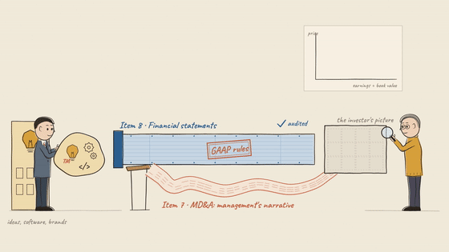
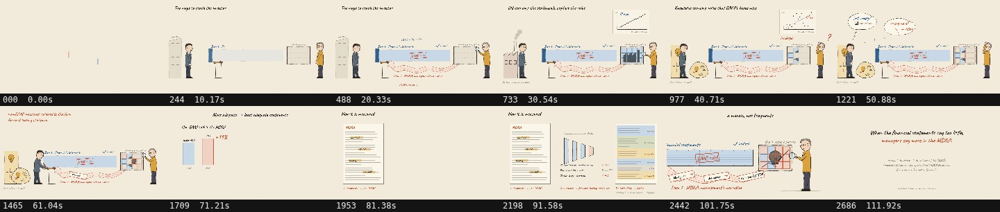

# Two Channels

**A 112-second hand-drawn explainer, written end to end by Claude Opus 5.5 in a single Claude Code session, of a Contemporary Accounting Research paper.**

The paper is Brown, Hinson & Tucker (2024), *"Financial statement adequacy and firms' MD&A disclosures."* Firms report to investors through two channels: the rigid, audited, GAAP-ruled financial statements (Item 8), and the flexible MD&A narrative (Item 7). When the financial statements are inadequate — value that GAAP's boxes can't hold, as for a knowledge-economy firm — managers say more through the MD&A instead: more non-GAAP measures, more forward-looking statements. The film tells that story with two recurring characters, a manager and an investor, a rigid blue duct against a flexible red ribbon, and a tile board that fills in as the investor's picture of the firm.

This repo shows exactly how it was made: the paper's abstract and introduction (the only input), the code Claude wrote, and the commands that turned it into an MP4.

[](two-channels-narrated.mp4)

*GitHub won't play video inline in a README — click the clip above (or the link below) to open `two-channels-narrated.mp4` and play it with sound in GitHub's own viewer.*



| File | What it is |
|---|---|
| [`two-channels-narrated.mp4`](two-channels-narrated.mp4) | Final film: picture, music, voice-over, subtitle track (1920×1080, 24 fps, 112 s) |
| [`two-channels.html`](two-channels.html) | The live version: open it in a browser (silent, with a scrubber) |

## What happened

The prompts are in [`../.journal/prompt/202609/prompt-20260923-1854-philipp-two-channels-film.md`](../.journal/prompt/202609/prompt-20260923-1854-philipp-two-channels-film.md).
A session summary is in [`../.journal/journal/202609/journal-20260923-1854-philipp-two-channels-film.md`](../.journal/journal/202609/journal-20260923-1854-philipp-two-channels-film.md).
The full prompt/answer transcript is in [`../.journal/sessions/202609/car_paper_animation.md`](../.journal/sessions/202609/car_paper_animation.md).
In short:

1. **`/hand-drawn-canvas-animation create a video animation for this paper's idea of two disclosure channels`**, with the paper's abstract and introduction pasted in. Claude wrote a brief (cast, palette, beat sheet, hardest action), a narration script, and generated the voice-over first so that every scene's length would follow the spoken line, not the other way around.
2. Claude built the film itself — `two-channels.html`, a 10-scene canvas animation with two hand-rigged characters — then checked it with full-size stills and cropped frame-by-frame strips of the hardest shot (a soft "ideas" blob jamming in a square duct), fixing what read wrong.
3. **"That two-channels.mp4 does not have voice?"** — a naming mix-up: the silent, music-only and narrated files are three separate outputs of `mix.sh`.
4. **"Use python to gen some background music... I want the background music to be more light and joyful."** Claude wrote a numpy synthesizer, first a darker draft, then a D-major, 104 BPM score with marimba, glockenspiel, ukulele strum and cues on the visible actions (stamp, bonks, tiles landing, pen).
5. Claude drafted a LinkedIn post announcing the video, revised it on request to credit the paper's authors and note that the voice-over runs on Qwen3-TTS locally.

## How it works

```
two-channels.html ──(render.mjs, Puppeteer)──► frames
music.py       (numpy synth, cues on timing.js)  ► out/music.wav
narration.json ─► voice.py (Qwen3-TTS, local) ──► out/voice/narration.wav + .srt + timing.js
                                            mix.sh (ffmpeg) ──► two-channels-narrated.mp4
```

**Voice first, picture second** (`narration.json`, `voice.py`, `timing.js`)
- 15 lines across 10 scenes are written, then voiced with a local Qwen3-TTS (0.6B Base) clone in x-vector mode. `voice.py` times each spoken line, derives every scene's duration from it, and writes `timing.js` — the film's picture is locked to the narration, not the other way around.
- Pronunciation of "GAAP", "MD&A" and "R squared" was checked by transcribing the narration with a small local Whisper model and diffing it against the script.

**Picture** (`two-channels.html`, `core.js`, `studio.js`, `cels.js`, `materials.js`)
- Ten scenes on a 1920×1080 stage: a manager (suit, tie) and an investor (round glasses, magnifier) built from authored pose landmarks (`MAN`, `INV` in `two-channels.html`), with whole-drawing "cels" rebuilt per exposed pose rather than a live skeletal rig.
- The financial-statement channel is a rigid blue duct, stamped "GAAP rules" and "audited"; the MD&A channel is a flexible red paper ribbon. A 4×3 tile board fills in blue and red as the investor's picture of the firm.
- `core.js`/`studio.js`/`cels.js` are the shared hand-drawn-canvas engine (palettes, marks, exposure sheets, camera, timeline, player); `render.mjs` drives headless Chrome to capture frames or preview grids/strips for QA.
- The handwriting font is Caveat (SIL OFL, `fonts/OFL.txt`), embedded so lettering renders identically on any machine.

**Sound** (`music.py`)
- Every note is synthesized: glockenspiel tunes over off-beat marimba chords, a plucked ukulele-like strum, shaker and claps, in D major at 104 BPM with no minor chords — the jam and the question play as playful pizzicato rather than anything sad. Cues (stamp, bonks, tiles, pen) sit on the same frame timeline as the picture and voice.

**Mix** (`mix.sh`)
- ffmpeg sidechain-compresses the music under the voice, mixes them, and muxes in the SRT subtitle track, producing `two-channels-narrated.mp4` (2,687 frames, 24 fps).

## Reproduce it

Requires Node ≥22.12, `ffmpeg`, Google Chrome/Chromium, and Python packages `numpy scipy soundfile`. Voice generation needs a separate env with `qwen-tts`, a CUDA GPU, and a reference clip at `../film/voice/ref_clone.wav` (not included in this repo).

```bash
npm install                       # puppeteer-core

# 1. voice + timing (in the qwen3-tts env)
python voice.py                   # writes out/voice/*, timing.js

# 2. picture → out/two-channels.mp4
node render.mjs two-channels.html

# 3. music → out/music.wav
python music.py

# 4. mix picture + music + voice + subtitles → two-channels-narrated.mp4
sh mix.sh
```

To change the narration, edit `narration.json`, re-run `voice.py` (scene lengths follow the spoken lines automatically), then repeat steps 2–4. `qa.sh` renders a cropped, numbered, tiled strip of consecutive frames for spot-checking a shot: `sh qa.sh START COUNT STEP X Y W H OUT.jpg`.

`docs/contact-sheet.jpg` and `docs/preview.gif` (used above) regenerate from the picture-only render:
```bash
node render.mjs two-channels.html --grid 12                              # writes out/two-channels-grid.jpg
ffmpeg -y -ss 31.0 -t 5.0 -i out/two-channels.mp4 -vf \
  "fps=12,scale=560:-1:flags=lanczos,split[s0][s1];[s0]palettegen=max_colors=192[p];[s1][p]paletteuse=dither=sierra2_4a" \
  -loop 0 docs/preview.gif
```

## Caveats

- **Audio was measured, not listened to.** Claude cannot hear. Voice-to-music balance and levels were checked with ffmpeg and a Whisper transcript, not by ear.
- **Visuals were checked with stills, not full playback.** Full-size frames and cropped frame-by-frame strips of the hardest action were reviewed; the finished video was not watched at normal speed.
- Two known rough edges at commit time: the manager's head slightly overlaps the "Item 8" label in the writing scene, and the "ideas" blob's position jumps on the cut between the question and writing scenes.
- The findings-scene bars are schematic, built from the paper's reported percentage effects rather than to exact scale (footnoted on screen).
- The narrator's voice is a placeholder clone; confirm rights to any reference clip before publishing further narrated cuts.
- Rendered frames, per-line voice clips and other intermediates live under `out/` and are gitignored — delete freely, everything regenerates from the steps above.

## Credits

Written by Claude Opus 5.5 (`claude-opus-5-5`) in Claude Code, directed by the prompts above, from the abstract and introduction of Brown, Hinson & Tucker (2024, *Contemporary Accounting Research*). Voice model: [Qwen3-TTS](https://github.com/QwenLM/Qwen3-TTS) by the Qwen team, run locally. Handwriting font: [Caveat](https://fonts.google.com/specimen/Caveat) (SIL OFL).
